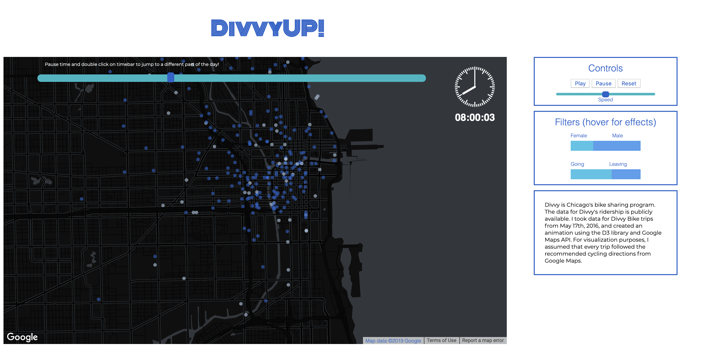
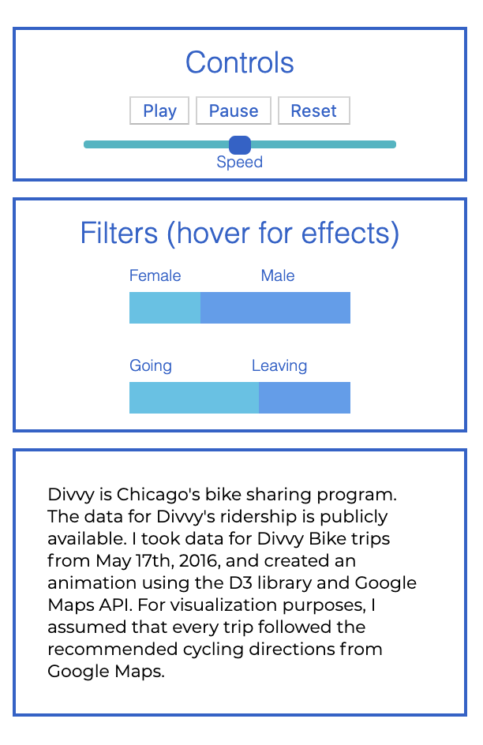

# DivvyUp
Divvy, Chicago's bike sharing program, has publicly available data representing all of the bike trips taken using their bicycles on a daily basis. 



DivvyUp! is a data visualization project presents all bike trips taken over the course of a single day, May 17th, 2016. While Divvy provides start and end points for each trip, I visualized each trip taking place on actual roads by utilizing Google Directions API and assuming that each bike trip follows the recommended route.

```javascript
const current_location = (steps, time) => {
    const p = parseFloat;
    let i = 0;
    let distanceCovered = 0;
    while(true){
        distanceCovered += steps[i].distance;
        if (time / velocity < distanceCovered){
            break;
        }
        i++;
    }

    const timeInInterval = distanceCovered * velocity - steps[i].distance * velocity;
    const t = time - timeInInterval;

    const startLat = p(steps[i].start_location.lat);
    const startLon = p(steps[i].start_location.lng);

    const endLat = p(steps[i].end_location.lat)
    const endLon = p(steps[i].end_location.lng)

    const currLat = ((t) * (endLat - startLat) / (steps[i].distance * velocity )+ startLat)
    const currLon = ((t) * (endLon - startLon) / (steps[i].distance * velocity) + startLon)

    return {
        lat: Number(currLat),
        lon: Number(currLon),
        display: true
    };

};
```
When Google Directions API sends back information about a recommended route, it provides a series of 'steps' containing latitudinal and longitudinal points and the distance between each step. I calculated the location of each bike along the trip for each millesecond using the distance covered, the distance between each step, and the time each interval(step) took to complete.

I then plotted these latitude and longitude points on a map using the d3 libarary.



DivvyUp! is interactive in that users can maniuplate the speed of time, visualize male versus female riders, and view riders entering or leaving downtown. Users can also change the time of day to visualize bike traffic during peak commute hours versus other periods of the day.

```javascript
const drawGender = (data) => {
    const min = Math.floor(time/60);
    d3.select('#genderdisplay').style('display','flex');
    const female = d3.select('#fem')
    .style('width', `${parseFloat((data[min].femaleCount)) / (parseFloat(data[min].femaleCount) + parseFloat(data[min].maleCount)) *100}px`)
        .style('background', '#48c3e7');

    const male  = d3.select('#male')
        .style('width', `${parseFloat((data[min].maleCount)) / (parseFloat(data[min].femaleCount) + parseFloat(data[min].maleCount)) * 100}px`)
        .style('background', '#569dee')
        .style('text-align', 'right')
};

```
I utilized Python to generate custom data for the map such as the number of males versus females taking Divvy trips at any minute so that I could provide an interactive bar graph to demonstrate the ratio.
